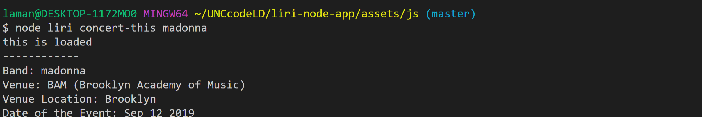
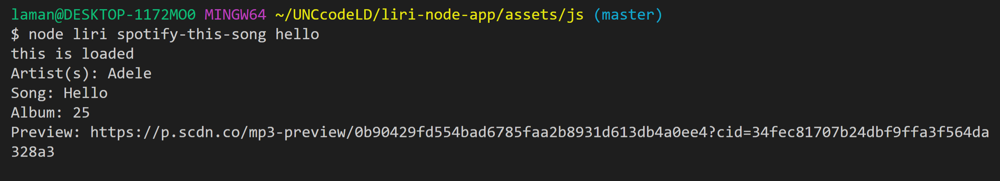
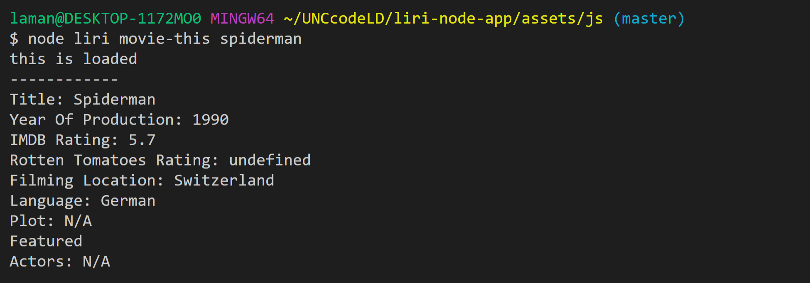
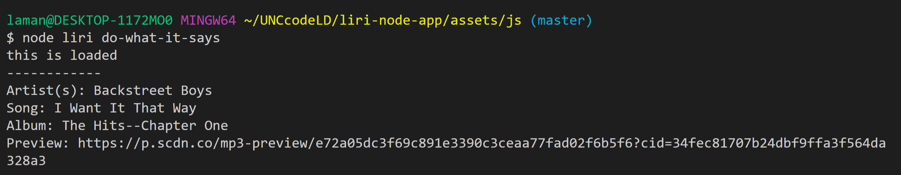

# LIRI Bot

## Introduction

> LIRI is a command-line node app that allows users to enter a query to search Spotify for songs, Bands in Town for concerts, and OMDB for movies and retuns results.

## GitHub repo and Live site
https://lamanaml.github.io/liri-node-app/

https://github.com/lamanaml/liri-node-app

### NPM's used
Node-Spotify-API

Axios

Moment

DotEnv

FS

### API's used
OMDB API

Bands In Town API

### concert-this
>Uses the Axios NPM to get data from the Bands in Town API.  Also uses the Moment NPM to format the concert date. 

### spotify-this
>Uses the Spotify NPM to get data from  Spotify.

      
### movie-this
>Uses the Axios NPM to get data from the OMDB API.

     
### do-what-it-says
>Uses the FS NPM to read from a text file, parse the string into an array, identify the input and pass it through the function.

 